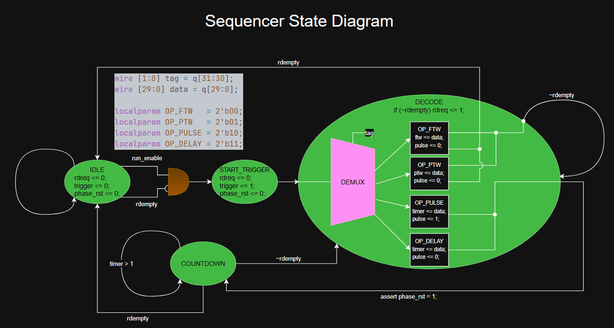

# Custom FPGA Pulse Programmer & Direct Digital Synthesizer (DDS)

This repository contains the Verilog HDL source code for a custom FPGA-based Pulse Programmer and Direct Digital Synthesizer (DDS). The system is designed to receive high-level instructions from a Hard Processor System (HPS) via a lightweight AXI bus, decode them in real-time, and generate phase-coherent, precisely timed RF pulses.

## System Architecture

The architecture is divided into two primary execution domains: the **Control/Sequencing Domain** and the **RF/Synthesis Domain**. Cross-domain clocking is handled safely using an Asynchronous FIFO.

### 1. Top-Level Wrapper
* **`platform_interface.v`**: The physical top-level wrapper module. It connects the HPS demands to the sequencer via the lightweight AXI bus using an asynchronous FIFO in show-ahead mode. It handles clock routing by instantiating the PLL block for 150 MHz operation. Finally, it features an output multiplexer that routes either the active NCO output or a DC silence value (`10'h1FF`) to the external 10-bit DAC based on the sequencer's pulse flag.

### 2. The Sequencer Domain
* **`sequencer.v`**: The brains of the instruction set decomposition. This module utilizes a Moore Finite State Machine (FSM) to slice the incoming 32-bit data into a 2-bit opcode "tag" and a 30-bit payload. It decodes the payload into a frequency tuning word (ftw), phase tuning word (ptw), or timer countdown value. It acts as both the dispatcher and the pulse controller, counting down clock cycles for RF pulses and delays while generating external oscilloscope triggers and phase resets.

### 3. The Direct Digital Synthesis (DDS) Domain
* **`nco.v`**: The Numerically Controlled Oscillator that acts as a wrapper for the phase accumulator and sine Phase-to-Amplitude Converter (PAC). It injects the Phase Tuning Word (PTW) to offset the accumulated phase for real-time phase modulation.
* **`phase_accumulator.v`**: A register that steps forward by the Frequency Tuning Word (FTW) on every 150 MHz clock cycle. It features a synchronous `phase_rst` input from the sequencer to zero out the phase for precise multi-pulse alignment.
* **`sine_pac.v`**: The Sine Phase-to-Amplitude Converter (PAC). It truncates the 30-bit phase index into a 10-bit address (`lut_idx[29:20]`) and polls a precalculated lookup table memory block to output the proper 10-bit DAC value.

## Instruction Set Architecture (ISA)

The sequencer interprets 32-bit instruction packets directly. 
* **Bits [31:30]:** Opcode Tag
* **Bits [29:0]:** Payload Data

**Supported Opcodes:**
* **`2'b00` (OP_FTW):** Updates the frequency tuning word.
* **`2'b01` (OP_PTW):** Updates the phase tuning word.
* **`2'b10` (OP_PULSE):** Pulls the RF gate high (`pulse = 1`), resets the DDS phase, and counts down the duration payload in 150 MHz clock cycles.
* **`2'b11` (OP_DELAY):** Pulls the RF gate low (`pulse = 0`), resets the DDS phase, and counts down the duration payload in 150 MHz clock cycles.

## Setup and Implementation

### Prerequisites
* Intel Quartus (or equivalent synthesis tool if porting IP blocks).
* A precalculated hexadecimal sine lookup table named `sine_lut.hex` placed in the project directory. The table must define an array of 1024 rows of 10 columns of memory. It must be centered, meaning `10'h1FF` is the DC 0 value.

### Required IP Blocks
To compile this project, you will need to generate two standard IP blocks in your FPGA software:
1. **PLL (`pll_150mhz`)**: Takes the 50 MHz reference board clock and outputs a 150 MHz clock (`outclk_0`) and a `locked` signal.
2. **Asynchronous FIFO (`async_FIFO`)**: 32-bit wide, dual-clock FIFO for crossing from the 50 MHz HPS domain to the 150 MHz fabric domain.

## Block Diagrams & State Machines

Below are the schematics and behavioral diagrams mapping the current FPGA architecture:

### Platform Interface Block Diagram

  

### Sequencer State Diagram

  

### Numerically Controlled Oscillator Block Diagram

  

### Phase Accumulator Block Diagram

  

### Sine Phase-to-Amplitude Converter Block Diagram

  

