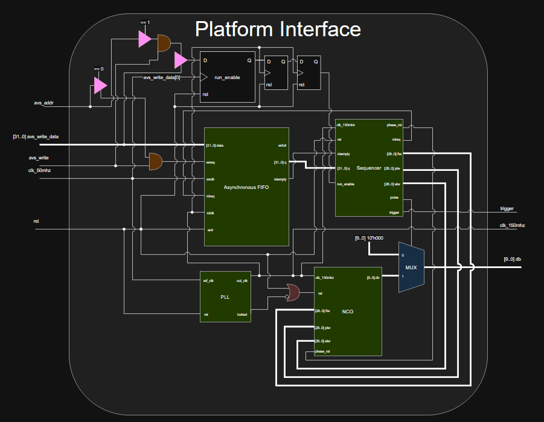
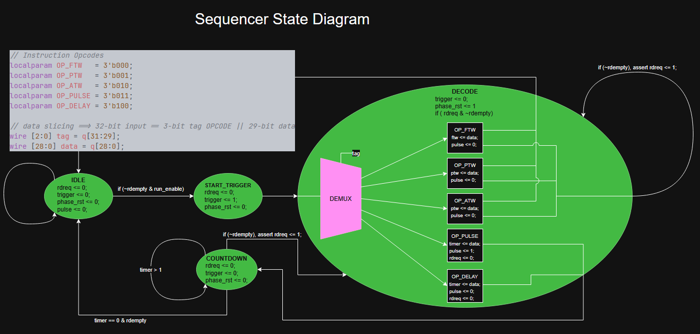
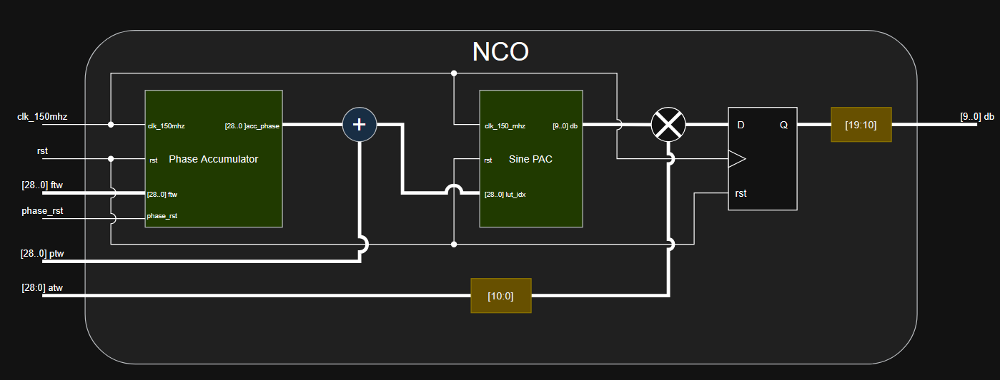
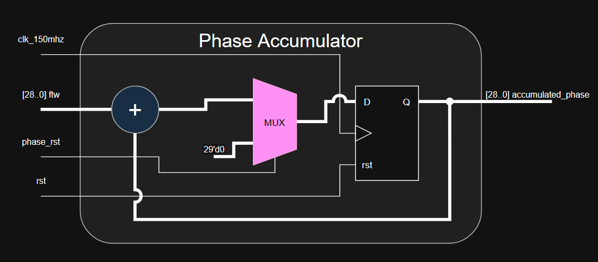
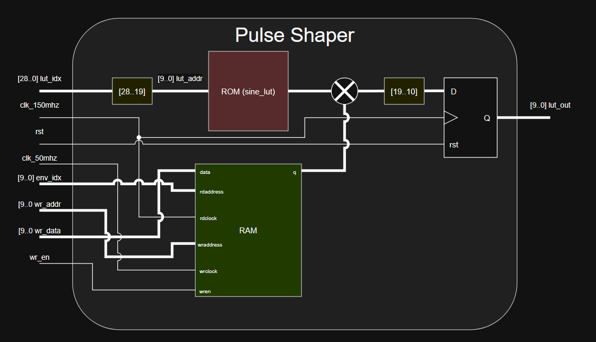

# Low-Cost RFSoC Control Platform

This repository contains the Verilog HDL source code and companion C/Python software stack for a low-cost SoC/FPGA control platform for high-precision RF pulse sequencing, envelope shaping, and quantum state manipulation. The system is designed to receive high-level instructions from an Intel Hard Processor System (HPS) via a lightweight AXI bus, decode them in real-time, and generate phase-coherent, precisely envelope-shaped RF pulses.

---

## Repository Structure

```text
.
├── sw/                         # Software Stack
│   ├── compiler/               # Python Assembly & DSL compiler
│   │   ├── pulse_lib.py        # High-level pulse sequence DSL
│   │   ├── assembler.py        # 32-bit binary encoder & instruction specs
│   │   └── test.py             # Test assembly scripts
│   ├── driver/                 # C Software Drivers & Hardware Abstraction Layer
│   │   ├── driver.h            # Memory-map, register offsets & function prototypes
│   │   ├── driver.c            # FPGA BRAM & control register drivers (Hardware/Mock)
│   │   └── runner.c            # CLI runner for binary sequence loading
│   └── bin/                    # Compiled binary outputs (git-ignored)
├── src/                        # Verilog HDL Hardware Source Files
│   ├── platform_interface.v    # Top-level AXI slave & CDC FIFO wrapper
│   ├── sequencer.v             # Instruction decoder & main control FSM
│   ├── nco.v                   # Numerically Controlled Oscillator & gain multiplier
│   ├── pulse_shaper.v          # Carrier-envelope product mixer & ROM lookup
│   └── accumulator.v           # Envelope phase/time accumulator
├── tb/                         # Simulation Testbenches
├── output_files/               # Quartus Synthesis & Bitstream Output (.sof, .rbf)
└── Makefile                    # Unified build & test pipeline
```

---

## System Architecture

The architecture is divided into two primary execution domains: the **Control/Sequencing Domain** and the **RF/Synthesis Domain**. Cross-domain clocking is handled safely using an Asynchronous FIFO and 3-stage CDC synchronizers.

### 1. Top-Level Wrapper

* **`platform_interface.v`**: The physical top-level wrapper module. It interfaces HPS commands from the lightweight AXI bus to the sequencer via an asynchronous FIFO in show-ahead mode. It features CDC synchronization for start triggers, controls PLL reset routing, and manages memory mapping (`0x0000_0000 - 0x0000_3FFF`, 16 KB span).

### 2. The Sequencer Domain

* **`sequencer.v`**: The instruction set decoder and execution core. Utilizes a Moore Finite State Machine (FSM) to split incoming 32-bit instruction words into a 3-bit opcode (`[31:29]`) and a 29-bit payload (`[28:0]`). It dispatches Frequency Tuning Words (FTW), Phase Tuning Words (PTW), Amplitude Tuning Words (ATW), and Envelope Tuning Words (ETW), while managing countdown timers and pulse output gates.

### 3. The Direct Digital Synthesis (DDS) & Pulse Shaping Domain

* **`nco.v`**: Numerically Controlled Oscillator block combining phase accumulation, envelope modulation, and output scaling multiplier.
* **`accumulator.v`**: Dual phase accumulator managing both carrier phase accumulation and envelope step counter (`env_acc`). Includes saturation logic at index 1023 to prevent envelope wrap-around.
* **`pulse_shaper.v`**: Reads two-component sine lookup tables and dual-port envelope RAMs. Performs signed multiplication of carrier waveform and envelope profile with matching clock latency.

---

## Instruction Set Architecture (ISA)

The sequencer interprets 32-bit instruction packets formatted as follows:

* **Bits [31:29]:** 3-bit Opcode
* **Bits [28:0]:** 29-bit Payload Data

| Opcode | Binary | Name | Description | Payload Encoding |
| :---: | :---: | :---: | :--- | :--- |
| `0x0` | `3'b000` | `OP_FTW` | Updates Frequency Tuning Word | $29\text{-bit FTW} = \frac{f_{\text{target}} \times 2^{29}}{f_{\text{clk}}}$ |
| `0x1` | `3'b001` | `OP_PTW` | Updates Phase Tuning Word | $29\text{-bit PTW} = \frac{\theta^{\circ} \times 2^{29}}{360^{\circ}}$ |
| `0x2` | `3'b010` | `OP_ATW` | Updates Output Amplitude Scale | $11\text{-bit ATW}$ ($0 \text{ to } 1024$ for $1.0\times$ full scale) |
| `0x3` | `3'b011` | `OP_ETW` | Sets Envelope Step Rate | $29\text{-bit ETW} = \frac{2^{29}}{\text{cycles}}$ |
| `0x4` | `3'b100` | `OP_PULSE` | Activates RF pulse gate (`pulse = 1`) | $29\text{-bit Timer Count} = (\text{clock cycles} - 1)$ |
| `0x5` | `3'b101` | `OP_DELAY` | Deactivates RF pulse gate (`pulse = 0`) | $29\text{-bit Timer Count} = (\text{clock cycles} - 1)$ |

---

## Software & Toolchain Workflow

The project includes a Python DSL compiler for defining sequences and a C runtime driver for loading binaries into FPGA memory space on ARM Linux.

### Python Assembler DSL

Python scripts inside `sw/compiler/` allow defining high-level pulse sequences in human-readable units (MHz, degrees, nanoseconds, gain fractions) and compiling them to exact 32-bit `sequence.bin` binary payloads.

```python
from pulse_lib import Sequence
from assembler import Compiler

# Initialize Sequence and Compiler
seq = Sequence()
comp = Compiler(clk_mhz=150.0)

# Define Pulse Instructions
seq.set_amp(1.0)        # 100% full scale amplitude gain
seq.set_freq(10.0)      # 10.0 MHz carrier frequency
seq.set_phs_off(90.0)   # 90 degrees phase offset
seq.pulse(500)          # 500 ns shaped RF pulse
seq.delay(200)          # 200 ns silence delay
seq.pulse(1000)         # 1000 ns shaped RF pulse

# Compile & Debug Output
comp.compile(seq, output_filename="sw/bin/sequence.bin")
comp.print_debug(seq)
```

### Driver & Execution (`driver.c` / `runner.c`)

The C runtime loads binary sequences directly into hardware using `/dev/mem` memory-mapping (`mmap`):

* **Platform Designer Base Address:** `0xFF200000`
* **Address Span:** `0x4000` (16 KB)
* **Word Offsets:** Offset `0` (FIFO Write Stream), Offset `1` (Hardware Start Trigger)

---

## Build & Automation Commands (`Makefile`)

The root `Makefile` automates local testing on host x86 PCs (using mock FPGA memory abstractions) and cross-compilation for the Intel Cyclone V SoC target environment.

* **Run complete mock pipeline test:**
  ```bash
  make test
  ```
  *(Compiles Python sequence, builds local x86 runner, and validates binary loading in mock memory).*

* **Compile for physical ARM FPGA Board:**
  ```bash
  make arm
  ```
  *(Generates `sw/bin/runner` using the `arm-none-linux-gnueabihf-gcc` cross-compiler).*

* **Clean generated binaries & build trees:**
  ```bash
  make clean
  ```

---

## Prerequisites & Setup

### Hardware & FPGA Tools

* Intel Quartus Prime (Lite / Standard Edition for Cyclone V SoC)
* Precalculated 2's complement hexadecimal sine lookup table file named `sine_lut_2comp.hex` located in `src/`.

### Required FPGA IP Blocks

1. **PLL (`pll_150mhz`)**: 50 MHz input reference clock $\rightarrow$ 150 MHz system clock (`outclk_0`) + `locked` signal.
2. **Asynchronous FIFO (`async_FIFO`)**: 32-bit wide dual-clock FIFO for HPS-to-FPGA domain crossing in show-ahead mode.

### Software Toolchain

* Python 3.x
* GCC (for local x86 testing)
* Intel SoC EDS / `arm-none-linux-gnueabihf-gcc` cross-compiler toolchain

---

## Block Diagrams & State Machines

Below are the schematics and behavioral diagrams mapping the current FPGA architecture:

### Platform Interface Block Diagram
<div align="center">
  
</div>

### Sequencer State Diagram
<div align="center">
  
</div>

### Numerically Controlled Oscillator Block Diagram
<div align="center">
  
</div>

### Phase Accumulator Block Diagram
<div align="center">
  
</div>

### Pulse Shaper Block Diagram
<div align="center">
  
</div>
