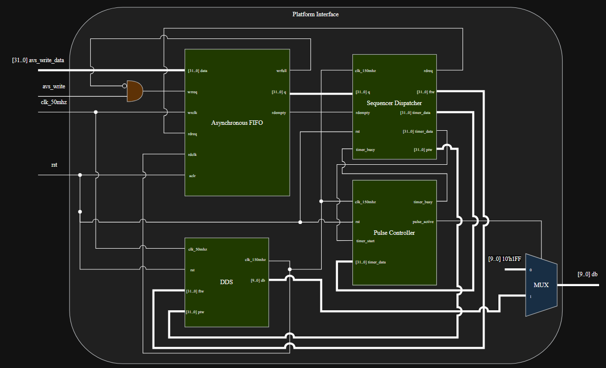
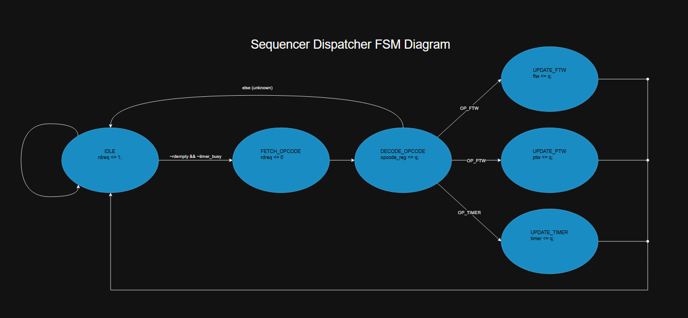
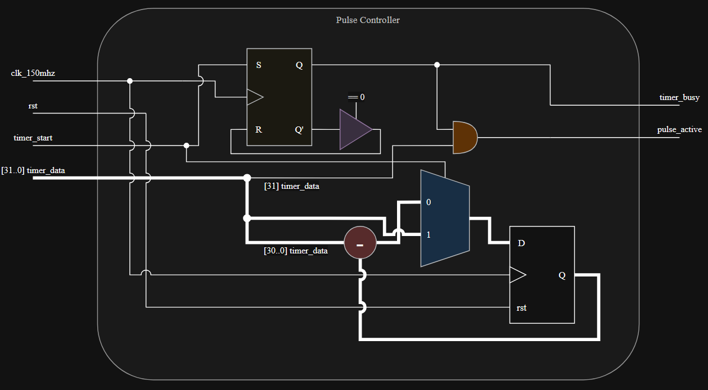
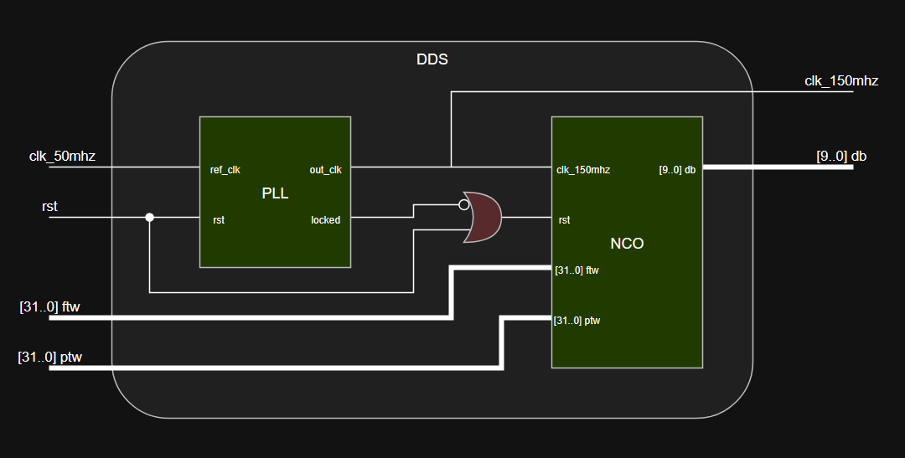
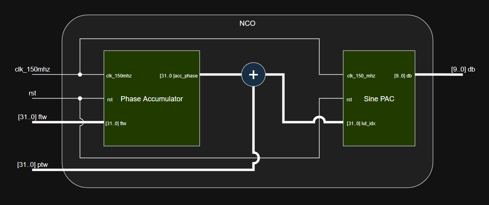
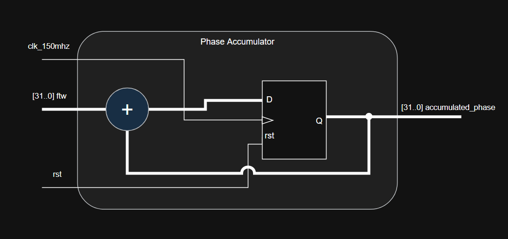
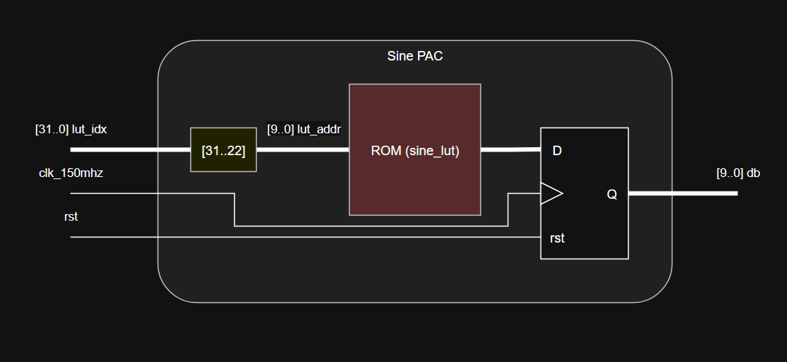

# Custom FPGA Pulse Programmer & Direct Digital Synthesizer (DDS)

This repository contains the Verilog HDL source code for a custom FPGA-based Pulse Programmer and Direct Digital Synthesizer (DDS). The system is designed to receive high-level instructions from a Hard Processor System (HPS) via a lightweight AXI bus, decode them in real-time, and generate phase-coherent, precisely timed RF pulses.

## System Architecture

The architecture is divided into two primary execution domains: the **Control/Sequencing Domain** and the **RF/Synthesis Domain**. Cross-domain clocking is handled safely using an Asynchronous FIFO.

### 1. Top-Level Wrapper
* **`platform_interface.v`**: The physical top-level module. It handles clock routing (50 MHz to 150 MHz via PLL), instantiates the Async FIFO to safely cross clock domains from the HPS Avalon bus, and manages the final output Multiplexer that routes either the DDS sine wave or a silence value (`10'h1FF`) to the external 10-bit DAC.

### 2. The Sequencer Domain
* **`sequencer_dispatcher.v`**: The brains of the operation. It acts as an instruction decoder using a Moore Finite State Machine (FSM). It reads 32-bit, 2-word instruction packets (Opcode + Payload) from the FIFO and routes the payload to the Frequency Tuning Word (FTW), Phase Tuning Word (PTW), or the Timer. 
* **`pulse_controller.v`**: The hardware execution timer. It receives duration payloads, slices the MSB to determine if the event is an RF Pulse or a Delay (silence), and physically counts down clock cycles. It utilizes a hardware handshake (`timer_busy`) to provide backpressure to the dispatcher, ensuring perfect sequential execution.

### 3. The Direct Digital Synthesis (DDS) Domain
* **`dds.v`**: The top-level wrapper for the synthesizer. It contains the PLL block (generating the 150 MHz execution clock) and instances the NCO.
* **`nco.v`**: The Numerically Controlled Oscillator. It merges the Phase Accumulator output with the Phase Tuning Word (PTW) to allow for real-time phase modulation.
* **`phase_accumulator.v`**: A 32-bit accumulator that steps forward by the Frequency Tuning Word (FTW) on every clock cycle to generate the base frequency.
* **`sine_pac.v`**: The Phase-to-Amplitude Converter. It truncates the 32-bit phase index into a 10-bit address and looks up the corresponding amplitude in a precalculated sine wave memory block (`sine_lut.hex`).

## Instruction Set Architecture (ISA)

The dispatcher interprets 2-word packets. The first word is the Opcode, and the second word is the raw data payload.

* **`0x0000_0001` (SET_FTW):** Updates the phase accumulator step size (Frequency).
* **`0x0000_0002` (SET_PTW):** Updates the phase offset register (Phase).
* **`0x0000_0003` (TIMER):** Triggers a countdown. 
  * Payload Bit `[31]`: RF Gate (1 = RF Pulse, 0 = Delay)
  * Payload Bits `[30:0]`: Duration in 150 MHz clock cycles.

## Setup and Implementation

### Prerequisites
* Intel Quartus (or equivalent synthesis tool if porting IP blocks).
* A precalculated hexadecimal sine lookup table named `sine_lut.hex` placed in the project directory. The table should contain 1024 values (10-bit addressing) formatted for a 10-bit DAC output, with `0x1FF` as the DC center.

### Required IP Blocks
To compile this project, you will need to generate two standard IP blocks in your FPGA software:
1. **PLL (`pll_150mhz`)**: Takes the 50 MHz board clock and outputs a 150 MHz clock.
2. **Asynchronous FIFO (`async_FIFO`)**: 32-bit wide, 4096 word, dual-clock FIFO for crossing from the 50 MHz HPS domain to the 150 MHz fabric domain.

## Block Diagrams | State Machine

Below are all of the block diagrams or state diagrams of the custom modules:

### Platform Interface Block Diagram

  

### Sequencer Dispatcher Block Diagram

  

### Pulse Controller Block Diagram

  

### Direct Digital Synthesis Core Block Diagram

  

### Numerically Controlled Oscillator Block Diagram

  

### Phase Accumulator Block Diagram

  

### Sine Phase-to-Amplitude Converter Block Diagram

  

